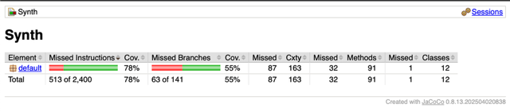

# FinalCS2

# Description:

This repo contains a simple synthesizer program with GUI built using JSyn library for the backend and JavaFX for the frontend. The synthesizer can generate different types of sounds (sine, square, sawtooth, triangle) and has an ADSR envelope and a Variable State Filter currently set to lowpass and given default values upon connection. The synthesizer is controlled using a keyboard and the GUI. The GUI allows the user to control the ADSR envelope and the oscillator types. This repo also contains unit tests using JUnit mainly creating a synth and setting valid and invalid values for the different components specifically the envelope and oscillator types. Also you can generate a coverage report using JaCoCo.

# Signal Chain:

Oscillator -> Envelope -> Filter -> Mixer -> LineOut

Features:
- Synthesizer with different oscillator types (sine, square, sawtooth, triangle)
- ADSR envelope for each voice
- GUI for controlling the synthesizer
- Unit tests using JUnit
- JaCoCo coverage report

# Dependencies:
- JSyn library
- JUnit library
- asm-9.7 library (for JaCoCo)
- asm-commons-9.7 library (for JaCoCo)
- asm-tree-9.7 library (for JaCoCo)
- asm-util-9.7 library (for JaCoCo)
- asm-analysis-9.7 library (for JaCoCo)
- JaCoCo library
- JaCoCo core library
- JaCoCo agent library
- JaCoCo report library
- JavaFX library
- Java 11 (at least)
- plantuml library (for UML diagram)

# Installation:

- Clone this repository
  run the following commands in the root directory
- run `ant build` (build the project)
- run `ant run-synth` (run the synthesizer)
- run `ant jacoco-report` (generate JaCoCo report)

# Usage:
  run the following commands in the root directory
- run `ant clean` (clean up previous build)
- run `ant run-synth` (run the synthesizer)

# Test:
  run the following commands in the root directory
- run `ant test` (run the tests)
- run `ant jacoco-report` (generate JaCoCo report)

# Sample Output:

GUI:

Junit:

JaCoCo Report:

 

GitHub:

# Software Design:

Envelope class:

the envelope class is a class that contains the attack, decay, sustain, and release setter and getter methods for the ADSR envelope(but I used a DAHDSR envelope instead for the same effect as it was said to be easier to work with but with more control). The envelope is implemented using the JSyn library.

Filter class:

the filter class is a class that contains the cutoff frequency and resonance setter and getter methods for the filter. The filter is a Low Pass Filter that is implemented using the JSyn library. currently the cutoff frequency is set to 2000 Hz and the resonance is set to 0.5 and we cant actually manipulate it from the GUI YET!! coming soon in v1.2 however we do set default values for the filter and we do connect it to the signal chain so it can be used to filter the signal.

SynthVoice class:

the synthvoice class extends unitgenerator and contains methods to set and create the oscillator and where we add the other important components to the signal chain. Also important is its ability to refresh the signal chain and to trigger the envelope which is used to control the amplitude of the signal thus giving us sound to modulate and output

*note I left print statements in the synthvoice class to help with debugging and also to give visual feedback on how the connections are being made when switching oscillator types and refreshing the signal chain*

Synth class:

the synth class is where the mainlineout as well as the mixer is created and the voices are added to the synth. It is sent events from the keyboard controller class. The voices are added to the synth using streams. This is where the synth is also started and stopped and from which notes are triggered which then trigger the individual voices to play.

KeyboardController class:

the keyboard controller class is a class that contains the "keyboard" which is implemented using a HashMap to map the key to MIDI notes. It is basically in control of the synth as its job is to send events to the synth. The synth is passed to the keyboard controller class.

SynthUI class:

the synthui class is a class that contains the UI which is implemented using JavaFX. The UI is pretty minimalistic and only contains a few sliders for the envelope and a few buttons for the oscillator type. This UI class also creates events of its own in order to control the synth specifically the envelope which from top to bottom the sliders are attack, decay, sustain, release and the oscillator type buttons are sine, square, sawtooth, triangle.
the UI class also utilizies state listeners to update the UI when the envelope parameters are changed and then we refresh the signal chain to recalibrate the synth.

OscType class:

contains the oscillator types as an enum.

# Challenges:

synth/ui challenges:
initially I was having issues with the keyboard controller not working after a button was selected. I was able to fix this by adding a request focus on the frame. After this another problem that occured was that the events were being sent however the synth was not playing becasue after switching oscillator types the signal chain was not being refreshed. I was able to fix this by adding a refresh signal chain method to the synthvoice class and calling it in the synth class.

build.xml/jacoco challenges:
I had issues getting jacoco to work I had to do some research to find out how to properly wrap the ant tasks and how to use the taskdef element. Also I had to make sure that the jacocoagent was added to the classpath along with all the necessary libraries. Which is where the asm libraries came into play. It was also a bit of a read to understand javax.swing.event and javax.swing.

UML diagram:

# Sources:
JSyn Reference:

https://www.softsynth.com/jsyn/tutorial/
https://www.softsynth.com/jsyn/docs/usersguide.php#JSynPackage
https://github.com/philburk/jsyn/blob/master/src/main/java/com/jsyn/Synthesizer.java
http://jsyn.com/jsyn/docs/javadocs/com/jsyn/unitgen/LinearRamp.html
http://jsyn.com/jsyn/docs/javadocs/com/jsyn/unitgen/EnvelopeDAHDSR.html
http://jsyn.com/jsyn/docs/javadocs/com/jsyn/unitgen/UnitGenerator.html

JaCoCo Reference:

https://www.baeldung.com/jacoco
https://ant.apache.org/manual/using.html
https://www.jacoco.org/jacoco/trunk/doc/cli.html
https://www.eclemma.org/jacoco/trunk/doc/ant.html

Build.xml Reference:

https://www.geeksforgeeks.org/html/how-to-define-structure-of-xml-document/
https://ant.apache.org/manual/Tasks/java.html
https://ant.apache.org/manual/Tasks/taskdef.html

JavaFX Reference:

https://docs.oracle.com/javase/8/docs/api/javax/swing/package-summary.html
https://docs.oracle.com/javase/8/docs/api/javax/swing/JSlider.html
https://docs.oracle.com/javase/8/docs/api/javax/swing/JPanel.html
https://docs.oracle.com/javase/21/docs/api/javax/swing/JFrame.html
https://docs.oracle.com/en/java/javase/17/docs/api/java.desktop/javax/swing/event/package-summary.html
https://docs.oracle.com/javase/8/docs/api/javax/swing/event/ChangeListener.html
https://docs.oracle.com/javase/8/docs/api/javax/swing/event/ChangeEvent.html
https://docs.oracle.com/javase/8/docs/api/java/awt/event/WindowAdapter.html
https://docs.oracle.com/javase/8/docs/api/java/awt/event/WindowEvent.html
https://docs.oracle.com/javase/8/docs/api/java/awt/event/ActionEvent.html
https://docs.oracle.com/javase/8/docs/api/java/awt/event/ActionListener.html

future features:
filter controls on ui for cutoff frequency and resonance
dedicated custom mixer class 
dedicated custom lineout class
